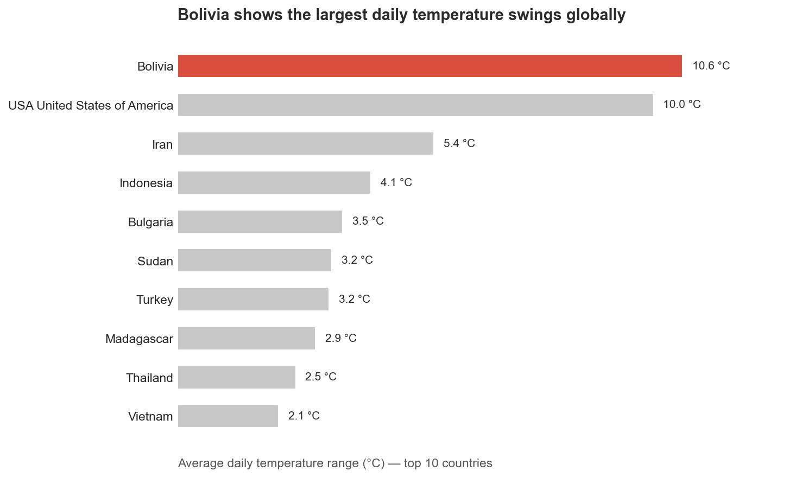
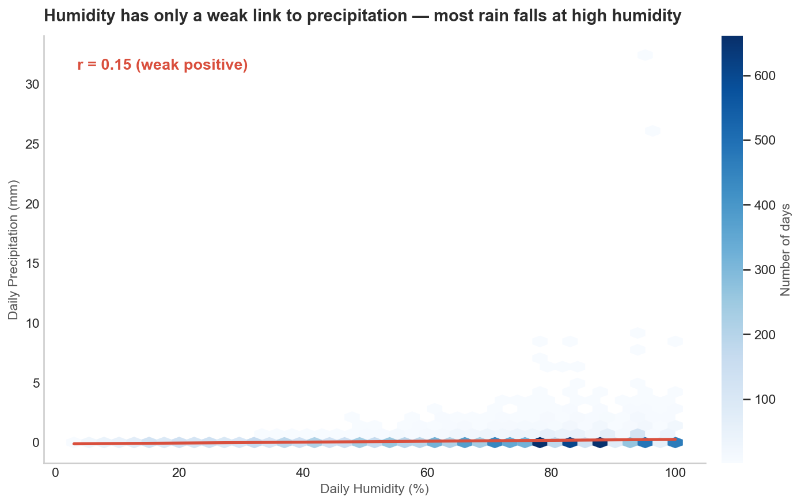
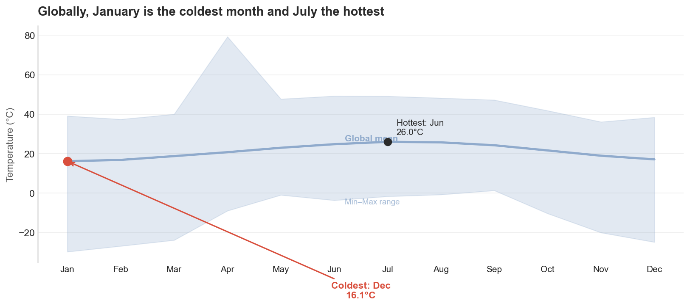
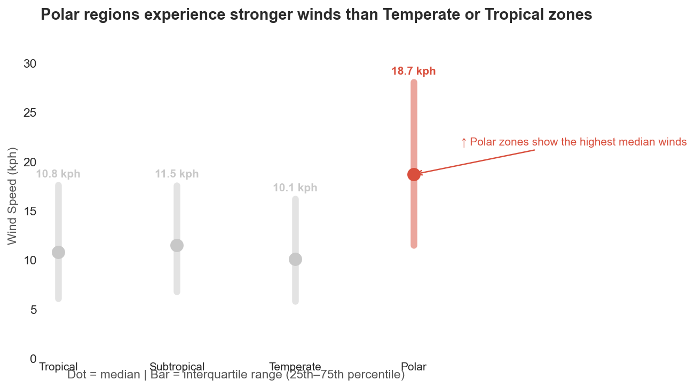
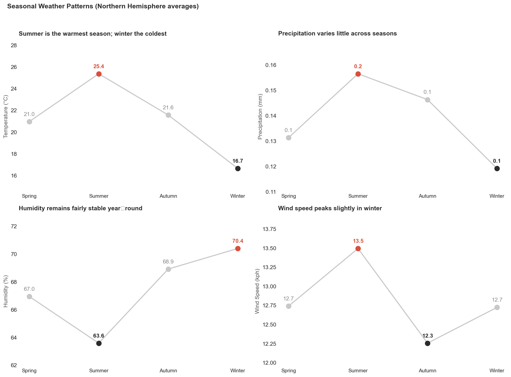

# Weather Pattern Intelligence – Executive Summary

**Date:** June 29, 2026  
**Analysis Period:** May 2024 – June 2026 (774 days)  
**Coverage:** 211 countries / 4 climate zones

## 1. Objective
This report analyzes historical weather patterns to support strategic decisions for crop planning, delivery scheduling, and risk management.

## 2. Key Findings

### 2.1 Extreme Temperature Fluctuations (Q1)
- **Bolivia (10.6°C)** and **USA United States of America (10.0°C)**  

### 2.2 Humidity vs. Precipitation (Q2)
Correlation r = 0.15 (weak positive)  

### 2.3 Hottest & Coldest Months (Q3)
- Hottest: 7 (26.0°C)  
- Coldest: 1 (16.1°C)  

### 2.4 Wind Speed by Climate Zone (Q4)
| Zone | Speed (kph) |
| :--- | :---: |
| Polar | 21.6 |
| Subtropical | 13.2 |
| Tropical | 12.9 |
| Temperate | 11.8 |

### 2.5 Seasonal Patterns (Q5)
| Season | Temp (°C) |
| :--- | :---: |
| Spring | 21.0 |
| Summer | 25.4 |
| Autumn | 21.6 |
| Winter | 16.7 |

## 3. Risks & Opportunities
... (see notebook for full details)

## 4. Recommendations
... (see notebook)

## 5. Deliverables
- `output/cleaned_weather_data.csv`
- `charts/` (5 images)
- This report: `reports/Executive_Summary.md`

---
**Prepared by:** Khoro Avhavhoni Tshivhula  
**Date:** June 29, 2026
